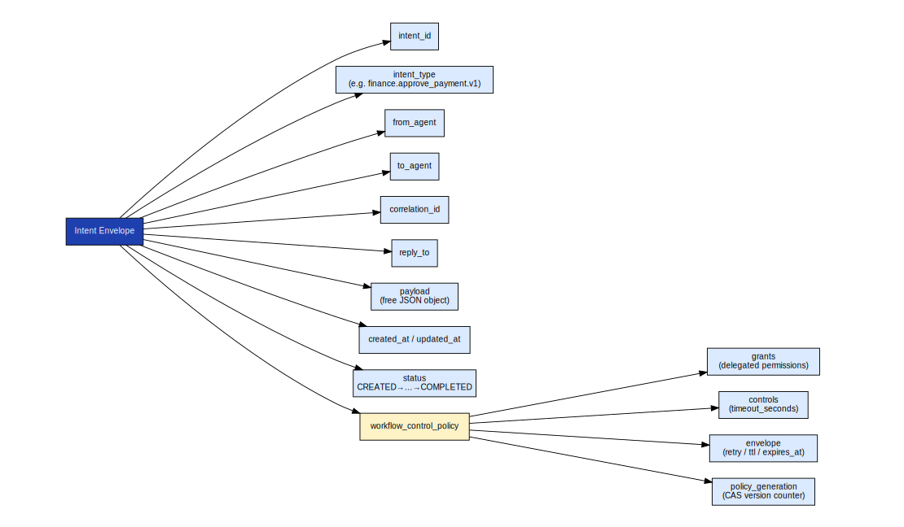

# axme-sdk-typescript

**Official TypeScript SDK for the AXME platform.** Send and manage intents, observe lifecycle events, handle approvals, and access the enterprise admin surface — fully typed, Promise-based, works in Node.js and edge runtimes.

> **Alpha** · API surface is stabilizing. Not recommended for production workloads yet.  
> Alpha access: https://cloud.axme.ai/alpha · Contact and suggestions: [hello@axme.ai](mailto:hello@axme.ai)

---

## What You Can Do With This SDK

- **Send intents** — create typed, durable actions with delivery guarantees
- **Observe lifecycle** — subscribe to real-time state events via SSE
- **Approve or reject** — handle human-in-the-loop steps from your application
- **Control workflows** — pause, resume, cancel, update retry policies and reminders
- **Administer** — manage organizations, workspaces, service accounts, and grants

---

## Install

```bash
npm install github:AxmeAI/axme-sdk-typescript
```

npm publication target: `axme` (pending npm account authorization for publish).

---

## Quickstart

```typescript
import { AxmeClient } from "axme";

const client = new AxmeClient({
  baseUrl: "https://gateway.axme.ai",
  apiKey: "YOUR_API_KEY",
});

// Check connectivity
console.log(await client.health());

// Send an intent
const intent = await client.createIntent(
  {
    intent_type: "order.fulfillment.v1",
    payload: { order_id: "ord_123", priority: "high" },
    owner_agent: "agent://fulfillment-service",
  },
  { idempotencyKey: "fulfill-ord-123-001" }
);
console.log(intent.intent_id, intent.status);
```

---

## API Method Families

The SDK covers the full public API surface organized into families:


*D1 families (intents, inbox, approvals) are the core integration path. D2 adds schemas, webhooks, and media. D3 covers enterprise admin. The SDK implements all three tiers.*

---

## Protocol Envelope

Every request from this SDK is wrapped in the AXP protocol envelope, handled transparently:



*The SDK sets `Idempotency-Key`, `X-Correlation-Id`, `X-Schema-Version`, and `Authorization` headers on every request. The gateway validates the envelope before processing the payload.*

---

## Idempotency

Every mutating method accepts an optional `idempotencyKey`. Pass it for any operation you might retry:


```typescript
// Safe to call multiple times — only executes once
const intent = await client.createIntent(payload, {
  idempotencyKey: "my-unique-key-001",
});
```

---

## Observing Events

```typescript
// Stream lifecycle events until resolution
for await (const event of client.observe(intent.intent_id)) {
  console.log(event.event_type, event.status);
  if (["RESOLVED", "CANCELLED", "EXPIRED"].includes(event.status)) break;
}
```

---

## Approvals

```typescript
// Fetch and approve pending items
const inbox = await client.listInbox({ ownerAgent: "agent://manager" });

for (const item of (Array.isArray(inbox.items) ? inbox.items : [])) {
  const threadId = typeof item?.thread_id === "string" ? item.thread_id : undefined;
  if (!threadId) continue;
  await client.approveInboxThread(
    threadId,
    { note: "Reviewed and approved" },
    { ownerAgent: "agent://manager" }
  );
}
```

---

## Workflow Controls

```typescript
// Update retry policy and add a reminder on a live intent
await client.updateIntentControls(intentId, {
  controls: {
    max_retries: 5,
    retry_delay_seconds: 30,
    reminders: [{ offset_seconds: 3600, note: "1h reminder" }],
  },
  policy_generation: intent.policy_generation,
});
```

---

## Repository Structure

```
axme-sdk-typescript/
├── src/
│   ├── client.ts              # AxmeClient — all API methods
│   ├── config.ts              # AxmeClientConfig type
│   └── errors.ts              # AxmeAPIError and subclasses
├── test/                      # Unit and integration tests
├── docs/
│   └── diagrams/              # Diagram copies for README embedding
└── tsconfig.json
```

---

## Tests

```bash
npm test
```

---

## Related Repositories

| Repository | Role |
|---|---|
| [axme-docs](https://github.com/AxmeAI/axme-docs) | Full API reference and integration guides |
| [axme-spec](https://github.com/AxmeAI/axme-spec) | Schema contracts this SDK implements |
| [axme-conformance](https://github.com/AxmeAI/axme-conformance) | Conformance suite that validates this SDK |
| [axme-examples](https://github.com/AxmeAI/axme-examples) | Runnable examples using this SDK |
| [axme-sdk-python](https://github.com/AxmeAI/axme-sdk-python) | Python equivalent |
| [axme-sdk-go](https://github.com/AxmeAI/axme-sdk-go) | Go equivalent |

---

## Contributing & Contact

- Bug reports and feature requests: open an issue in this repository
- Alpha access: https://cloud.axme.ai/alpha · Contact and suggestions: [hello@axme.ai](mailto:hello@axme.ai)
- Security disclosures: see [SECURITY.md](SECURITY.md)
- Contribution guidelines: [CONTRIBUTING.md](CONTRIBUTING.md)
